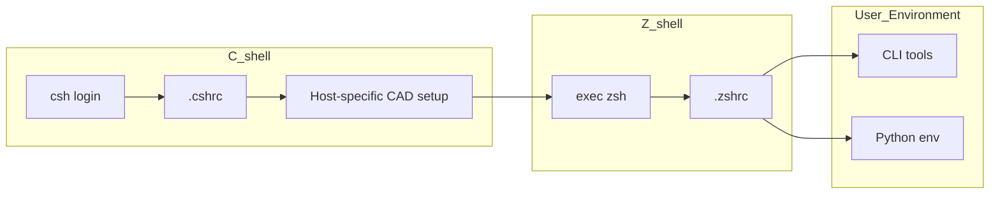

# dotfiles

[]()
[]()
[]()
[]()
[](./LICENSE)

## ✨ Overview

本リポジトリは、制約のあるCADサーバ環境において  
**ユーザ権限のみで開発環境を構築・改善するための dotfiles** です。

以下のような課題を解決することを目的としています：

- C Shell ベースのレガシーなシェル環境（tcsh 6.20.00, 2016）
- 古い Python（Python 3.6.8, 2018 / EOL: 2021）
- Git が未導入（`which git` -> not found）
- sudo 権限なし（`sudo` -> password required）

これらの制約下においても、ユーザローカル環境のみで以下を実現します：

- モダンなシェル環境（Z shell 5.9）
- 開発支援 CLI ツール群（Git, fzf, gh, ghq, Lazygit, Delta など）
- 新しい Python 実行環境（Python 3.12）

本リポジトリは以下の方針で設計しています：

- **既存の CAD 環境を壊さない**
  - CADツールは csh 前提のため、初期化は csh で実行
- **ユーザ領域のみで完結**
  - miniconda を用いてツール・Python環境を構築
- **再現可能な環境構築**
  - 設定・環境定義・スクリプトを分離して管理

## 🚀 Getting Started

以下を実行すると、環境構築が自動で行われます：

```csh
bash -c "curl -fsSL https://raw.githubusercontent.com/su-ito-lab/dotfiles/main/scripts/bootstrap.sh | bash"
source ~/.cshrc
rehash
```

### 🔄 更新（再実行）

```zsh
cd ~/src/github.com/su-ito-lab/dotfiles
bash scripts/setup.sh
```

## 🏗 Architecture



## 📁 Directory Structure

```
dotfiles/
├── csh/
│   └── .cshrc
├── zsh/
│   ├── .zshrc
│   └── .zsh/plugins/
├── git/
│   ├── .gitconfig
│   └── .gitconfig.local.example
├── gh/
│   └── .config/gh/
├── lazygit/
│   └── .config/lazygit/
├── nvim/
│   └── .config/nvim/
├── vim/
│   └── .vimrc
├── oh-my-posh/
│   └── .config/oh-my-posh/
├── conda/
│   └── .condarc
├── env/
│   ├── cli.yml
│   └── py312.yml
├── scripts/
│   ├── bootstrap.sh
│   └── setup.sh
├── README.md
└── LICENSE
```

## 📄 License

MIT License

See the [LICENSE](./LICENSE) file for details.
