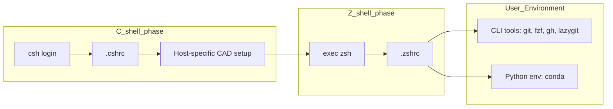

# dotfiles

[]()
[]()
[]()
[]()
[](./LICENSE)

## Overview

本リポジトリは、制約のあるCADサーバ環境において  
ユーザ権限のみで開発環境を構築・改善するための dotfiles です。

以下のような課題を解決することを目的としています：

- C Shell ベースのレガシーなシェル環境（tcsh 6.20.00, 2016）
- 古い Python（Python 3.6.8, 2018 / EOL: 2021）
- Git が未導入（`which git` -> not found）
- sudo 権限なし（`sudo` -> password required）

これらの制約下においても、ユーザローカル環境のみで以下を実現します：

- モダンなシェル環境（Z shell 5.9）
- 開発支援 CLI ツール群（Git, fzf, gh, ghq, Lazygit, Delta など）
- 新しい Python 実行環境（Python 3.12）

## Design

本リポジトリは以下の方針で設計しています：

- **既存の CAD 環境を壊さない**
  - CADツールは csh 前提のため、初期化は csh で実行
- **ユーザ領域のみで完結**
  - miniconda を用いてツール・Python環境を構築
- **再現可能な環境構築**
  - 設定・環境定義・スクリプトを分離して管理

## Architecture



### Shell bootstrap flow

1. csh が起動
2. `.cshrc` により CADツール設定を読み込み
3. 利用可能であれば zsh に `exec` で切り替え
4. `.zshrc` によりユーザ環境を初期化

この構成により、

- CAD環境との互換性を維持
- 日常作業はモダンなシェルで実行

を両立しています。

## Directory Structure

```
dotfiles/
├── csh/
│   ├── .cshrc                  # CAD 設定読み込み + zsh bootstrap
├── zsh/
│   ├── .zshrc                  # メインシェル設定
│   └── .zsh/plugins/           # プラグイン配置ディレクトリ（実体はスクリプトで取得）
├── git/
│   └── .gitconfig              # Git 共通設定（ユーザ情報は ~/.gitconfig.local へ）
├── gh/
│   └── .config/gh/             # GitHub CLI 設定
├── lazygit/
│   └── .config/lazygit/
├── vim/
│   └── .vimrc
├── oh-my-posh/
│   └── .config/oh-my-posh/themes/
├── conda/
│   └── .condarc
├── env/
│   ├── cli.yml                 # CLI ツール用環境
│   └── py312.yml               # Python 3.12 環境
├── scripts/
│   └── setup_zsh_plugins.sh    # zsh プラグインの取得
└── .gitignore
```

## Getting Started

### 1. Install Miniconda

ユーザ領域に Miniconda をインストールします。

```csh
wget https://repo.anaconda.com/miniconda/Miniconda3-latest-Linux-x86_64.sh
bash Miniconda3-latest-Linux-x86_64.sh
source ~/miniconda3/etc/profile.d/conda.sh
```

### 2. Install Git (via conda)

Git が未導入のため、conda 環境に Git を導入します。

```csh
conda create -n cli -c conda-forge git -y
conda activate cli
```

### 3. Clone this repository

本リポジトリを取得します。

```csh
git clone https://github.com/su-ito-lab/dotfiles.git
cd dotfiles
```

### 4. Create environments

CLIツールおよび Python 環境を構築します。

```csh
conda activate cli
conda env update -n cli -f env/cli.yml
conda env create -f env/py312.yml
```

### 5. Backup existing dotfiles (if any)

既存設定との競合を避けるため、必要に応じてバックアップを作成します。

```csh
mkdir -p ~/.bak
mv ~/.cshrc ~/.bak/ 2>/dev/null || true
mv ~/.zshrc ~/.bak/ 2>/dev/null || true
mv ~/.vimrc ~/.bak/ 2>/dev/null || true
mv ~/.gitconfig ~/.bak/ 2>/dev/null || true
```

### 6. Deploy dotfiles

stow を用いてホームディレクトリにシンボリックリンクを作成します。

```csh
stow -vt ~ csh zsh git gh lazygit vim oh-my-posh conda
```

### 7. Configure Git user info

Git のユーザ情報をローカル設定として登録します。

```csh
cp git/.gitconfig.local.example ~/.gitconfig.local
```

```
# Edit ~/.gitconfig.local

[user]
	name = your_name
	email = your.email@example.com
```

### 8. Install zsh plugins

zsh の外部プラグインをインストールします。

```csh
bash scripts/setup_zsh_plugins.sh
```

### 9. Restart shell

シェルを再読み込みします。

```csh
source ~/.cshrc
```

## Future Work

- セットアップの自動化
- Neovim 環境の整備

## License

MIT License

See the [LICENSE](./LICENSE) file for details.
